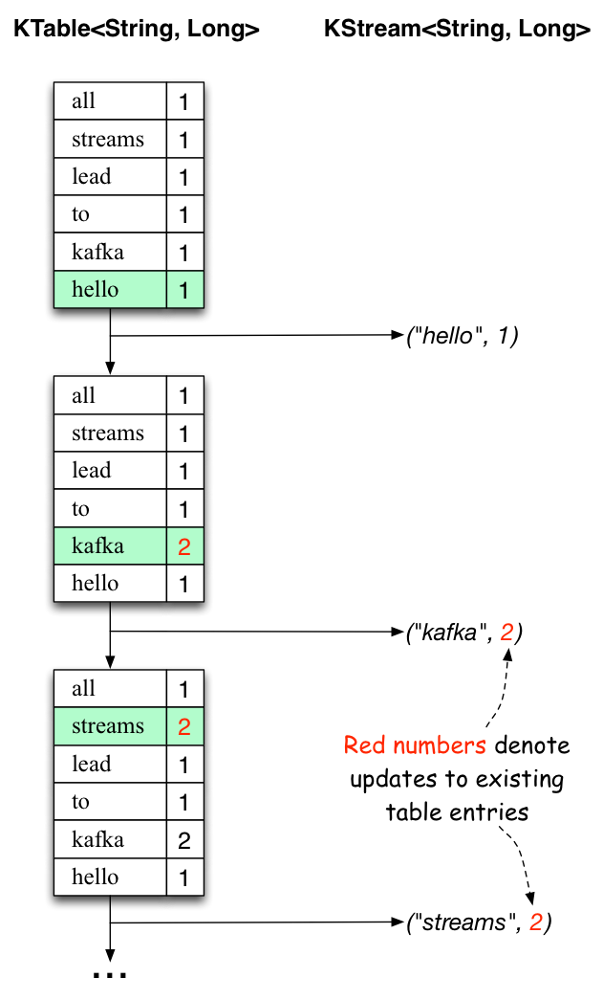

# Quick Start
本教程是假设您是初学者,没有现有的Kafka或ZooKeeper数据。 由于Kafka控制台脚本对于基于Unix和Windows平台不同，在Windows平台上使用bin \ windows \而不是bin /，并将脚本扩展名更改为.bat。

## 步骤1: 下载代码
在[这里](https://www.apache.org/dyn/closer.cgi?path=/kafka/0.10.2.0/kafka_2.11-0.10.2.0.tgz)下载relese版本.然后解压:
```shell
    > tar -xzf kafka_2.11-0.10.2.0.tgz
    > cd kafka_2.11-0.10.2.0
```

## 步骤2: 启动服务
Kafka需要使用ZooKeeper，所以你需要首先启动一个ZooKeeper服务器，如果你还没有。 可以使用与kafka一起打包的便利脚本来获取快速清理的单节点ZooKeeper实例。
```shell
	> bin/zookeeper-server-start.sh config/zookeeper.properties
	[2013-04-22 15:01:37,495] INFO Reading configuration from: config/zookeeper.properties (org.apache.zookeeper.server.quorum.QuorumPeerConfig)
...
```

启动Kafka服务
```shell
    > bin/kafka-server-start.sh config/server.properties
    [2013-04-22 15:01:47,028] INFO Verifying properties (kafka.utils.VerifiableProperties)
    [2013-04-22 15:01:47,051] INFO Property socket.send.buffer.bytes is overridden to 1048576 (kafka.utils.VerifiableProperties)
...
```

## 步骤3: 创建一个主题(topic)
让我们使用单个分区和单个副本创建一个名为“test”的主题：
```shell
	> bin/kafka-topics.sh --create --zookeeper localhost:2181 --replication-factor 1 --partitions 1 --topic test
```
现在只要运行list topic命令就可以看到刚才创建的主题(topic)了
```shell
	> bin/kafka-topics.sh --list --zookeeper localhost:2181
	test
```
或者,你也可以设置brokers配置为:发布到不存在的主题时自动创建主题,来替代手动创建主题.

## 步骤4: 发送消息
Kafka提供了一个命令行客户端，它将从文件或标准输入接收输入，并将其作为消息发送到Kafka集群。 默认情况下，每行都将作为单独的消息发送。

运行生产者，然后在控制台中键入一些消息发送到服务器。
```shell
    > bin/kafka-console-producer.sh --broker-list localhost:9092 --topic test
    This is a message
    This is another message
```

## 步骤5: 启动一个消费者
Kafka还有一个命令行消费者，将消息转储到标准输出。
```shell
	> bin/kafka-console-consumer.sh --bootstrap-server localhost:9092 --topic test --from-beginning
    This is a message
    This is another message
```
如果你有将上面的每个命令运行在不同的终端，那么你现在应该能够输入消息到生产者终端，看到他们出现在消费者终端。

所有命令行工具都有其他选项; 运行没有参数的命令将显示它们的使用信息。

## 步骤6: 设置多代理集群
首先，我们为每个代理创建一个配置文件（在Windows上使用复制命令）：
```shell
    > cp config/server.properties config/server-1.properties
    > cp config/server.properties config/server-2.properties
```
现在编辑这些新文件并设置以下属性：
```xml
    config/server-1.properties:
        broker.id=1
        listeners=PLAINTEXT://:9093
        log.dir=/tmp/kafka-logs-1

    config/server-2.properties:
        broker.id=2
        listeners=PLAINTEXT://:9094
        log.dir=/tmp/kafka-logs-2
```
broker.id属性是集群中每个节点的永久的唯一标识, 我们必须覆盖端口和日志目录，只是因为我们在同一台机器上运行这些，我们希望保持所有代理尝试在同一端口注册或覆盖彼此的数据。

我们已经有了Zookeeper和我们的单节点启动，所以我们只需要启动两个新的节点：
```shell
	> bin/kafka-server-start.sh config/server-1.properties &
    ...
    > bin/kafka-server-start.sh config/server-2.properties &
    ...
```
现在创建一个新的主题，复制因子(replication-factor)为3：
好了，但现在我们有一个集群，我们怎么知道哪个代理正在做什么？ 运行“describe topics”命令可以查看：
```shell
	> bin/kafka-topics.sh --describe --zookeeper localhost:2181 --topic my-replicated-topic
    Topic:my-replicated-topic	PartitionCount:1	ReplicationFactor:3	Configs:
        Topic: my-replicated-topic	Partition: 0	Leader: 1	Replicas: 1,2,0	Isr: 1,2,0
```

这里是输出的解释。第一行给出所有分区的摘要，每个附加行给出关于一个分区的信息。 由于我们对于这个主题只有一个分区，所以只有一行。
- “leader”是负责给定分区的所有读取和写入的节点。 每个节点将是分区的随机选择部分的领导者。
- “replicas”是复制此分区的日志的节点列表，无论它们是否为leader或者它们当前是存活(alive)的。
- “isr”是“同步中(in-sync)”副本的集合。 这是副本列表的子集，其当前节点存活并且caught-up to the leader(怎么翻译?)。

请注意，在我的示例中，节点1是主题的唯一分区的leader。
我们可以对我们创建的原始主题运行相同的命令，以查看它在哪里：
```shell
	> bin/kafka-topics.sh --describe --zookeeper localhost:2181 --topic test
    Topic:test	PartitionCount:1	ReplicationFactor:1	Configs:
        Topic: test	Partition: 0	Leader: 0	Replicas: 0	Isr: 0
```
让我们向我们的新主题发布几条消息：
```shell
    > bin/kafka-console-producer.sh --broker-list localhost:9092 --topic my-replicated-topic
    ...
    my test message 1
    my test message 2
    ^C
```
现在让我们使用这些消息：
```shell
    > bin/kafka-console-consumer.sh --bootstrap-server localhost:9092 --from-beginning --topic my-replicated-topic
    ...
    my test message 1
    my test message 2
    ^C
```
现在让我们测试容错。 Broker 1担任leader，所以让我们kill它：
```shell
    > ps aux | grep server-1.properties
    7564 ttys002    0:15.91 /System/Library/Frameworks/JavaVM.framework/Versions/1.8/Home/bin/java...
    > kill -9 7564
```
在Windows系统中可以使用以下命令:
```shell
    > wmic process get processid,caption,commandline | find "java.exe" | find "server-1.properties"
    java.exe    java  -Xmx1G -Xms1G -server -XX:+UseG1GC ... build\libs\kafka_2.10-0.10.2.0.jar"  kafka.Kafka config\server-1.properties    644
    > taskkill /pid 644 /f
```
Leadership已切换到其中一个从属节点，节点1不再处于同步副本集中：
```shell
    > bin/kafka-topics.sh --describe --zookeeper localhost:2181 --topic my-replicated-topic
    Topic:my-replicated-topic	PartitionCount:1	ReplicationFactor:3	Configs:
        Topic: my-replicated-topic	Partition: 0	Leader: 2	Replicas: 1,2,0	Isr: 2,0
```
但是消息仍然可用于消费
```shell
    > bin/kafka-console-consumer.sh --bootstrap-server localhost:9092 --from-beginning --topic my-replicated-topic
    ...
    my test message 1
    my test message 2
    ^C
```
## 步骤7:  使用Kafka Connect导入/导出数据
从控制台编写数据并将其写回到控制台是一个方便的地方，但您可能希望使用其他来源的数据或将数据从kafka导出到其他系统。 对于许多系统，不用编写自定义集成代码，您可以使用Kafka Connect导入或导出数据。

Kafka Connect是Kafka包含的工具，用于将数据导入和导出到Kafka。 它是一种运行连接器的可扩展工具，它实现与外部系统交互的自定义逻辑。 在这个快速启动中，我们将看到如何使用从文件导入数据到Kafka主题并将数据从Kafka主题导出到文件的简单连接器运行Kafka Connect。

首先，我们将创建一些种子数据来测试：
```shell
	> echo -e "foo\nbar" > test.txt
```
接下来，我们将启动以独立模式运行的两个connector，这意味着它们在单个本地专用进程中运行。我们提供三个配置文件作为参数。 第一个是Kafka Connect进程的配置，包含常见配置，如连接的Kafka broker和数据的序列化格式。剩下的配置文件都指定要创建的connector。 这些文件包括唯一的连connector名称，要实例化的connector类以及connector所需的任何其他配置。
```shell
	> bin/connect-standalone.sh config/connect-standalone.properties config/connect-file-source.properties config/connect-file-sink.properties
```
kafka附带的这些示例配置文件使用你之前启动的默认本地集群配置,并创建两个connector:一个是source connector,它从输入文件读取行,并将其生成到每个kafka topic,第二个是sink connector,它从kafka topic读取数据,并将其输出到文件中的一行.

在启动期间，您将看到一些日志消息，其中包括一些表示connector正在实例化的消息,一旦Kafka Connect进程开始，source connector应该开始从test.txt读取行，并将其产生到connect-test topic，并且sink  connector应该从topic connect-test开始读取消息并将它们写入测试文件.sink.txt。 我们可以通过检查输出文件的内容来验证数据是否通过整个流水线传送：
```shell
    > cat test.sink.txt
    foo
    bar
```
请注意，数据存储在Kafka的connect-test topic中，因此我们还可以运行控制台消费者来查看topic中的数据（或使用自定义消费者代码来处理它）：
```shell
    > bin/kafka-console-consumer.sh --bootstrap-server localhost:9092 --topic connect-test --from-beginning
    {"schema":{"type":"string","optional":false},"payload":"foo"}
    {"schema":{"type":"string","optional":false},"payload":"bar"}
    ...
```
connector会持续处理数据，因此我们可以将数据添加到文件中，并通过管道(pipeline)移动：
```shell
	> echo "Another line" >> test.txt
```
您应该看到行显示在控制台消费者输出和接收器文件中。

## 步骤8. 使用Kafka Streams处理数据
Kafka Streams是Kafka的客户端库，用于实时流处理和分析存储在kafka brokers中的数据。quick start示例将演示如何运行在此库中编码的流应用程序。 这是WordCountDemo示例代码的要点（转换为使用Java 8 lambda表达式以便于阅读）。
```java
    // String和Long类型的序列化/反序列化（serde）
    final Serde<String> stringSerde = Serdes.String();
    final Serde<Long> longSerde = Serdes.Long();

    // 从输入topic“streams-file-input”中构造一个“KStream”，其中消息值表示文本行（为了这个例子，我们忽略了消息键中可能存储的任何内容）。
    KStream<String, String> textLines = builder.stream(stringSerde, stringSerde, "streams-file-input");

    KTable<String, Long> wordCounts = textLines
        //将每个文本行由空格分割成单词。
        .flatMapValues(value -> Arrays.asList(value.toLowerCase().split("\\W+")))

        // 将文字分组为message key
        .groupBy((key, value) -> value)

        // 计算每个单词（message key）的出现次数。
        .count("Counts")

    //将运行计数作为更改日志流存储到输出topic。
    wordCounts.to(stringSerde, longSerde, "streams-wordcount-output");
```
它实现了WordCount算法，该算法从输入文本中计算关键字出现次数。 但是，与以前在有限数据上操作的其他WordCount示例不同，WordCount演示应用程序的行为略有不同，因为它被设计为在无限的无界数据流上运行。与有界变体类似,它是一种有状态的算法,可以跟踪并更新word的次数,然而，由于它必须承担潜在的无限制的输入数据，所以它会周期性地输出其当前状态和结果，同时持续处理更多的数据，因为它不知道何时处理完“全部”输入数据。

首先，我们将为Kafka topic准备输入数据，随后由Kafka Streams应用程序处理。
```shell
	> echo -e "all streams lead to kafka\nhello kafka streams\njoin kafka summit" > file-input.txt
```
在windows:
```shell
    > echo all streams lead to kafka> file-input.txt
    > echo hello kafka streams>> file-input.txt
    > echo|set /p=join kafka summit>> file-input.txt
```
接下来，我们使用console producer将此输入数据发送到名为streams-file-input的输入topic，该console producer逐行读取STDIN中的数据，并将每行作为单独的Kafka消息以空键和值编码字符串的topic（实际上，流数据可能会连续流入Kafka应用程序将启动和运行）：
```shell
    > bin/kafka-topics.sh --create \
                --zookeeper localhost:2181 \
                --replication-factor 1 \
                --partitions 1 \
                --topic streams-file-input
```
```shell
	> bin/kafka-console-producer.sh --broker-list localhost:9092 --topic streams-file-input < file-input.txt
```
我们现在可以运行WordCount演示应用程序来处理输入数据：
```shell
	> bin/kafka-run-class.sh org.apache.kafka.streams.examples.wordcount.WordCountDemo
```

演示应用程序将从输入topc streams-file-input读取，对每个读取的消息执行WordCount算法的计算，并将其当前结果持续写入输出topic streams-wordcount-output。 因此，除了日志条目之外，不会有任何STDOUT输出，因为结果被写回kafka。 该演示将运行几秒钟，然后，与典型的流处理应用程序不同，它会自动终止。
我们现在可以通过从其输出topic中读取来检查Word Count演示应用程序的输出：
```shell
    > bin/kafka-console-consumer.sh --bootstrap-server localhost:9092 \
                --topic streams-wordcount-output \
                --from-beginning \
                --formatter kafka.tools.DefaultMessageFormatter \
                --property print.key=true \
                --property print.value=true \
                --property key.deserializer=org.apache.kafka.common.serialization.StringDeserializer \
                --property value.deserializer=org.apache.kafka.common.serialization.LongDeserializer
```
将会有以下输出数据打印到控制台：
```console
    all     1
    lead    1
    to      1
    hello   1
    streams 2
    join    1
    kafka   3
    summit  1
```
如上信息,第一列是java.lang.String格式的Kafka消息key,第二列是java.lang.Long格式的消息value,注意,输出实际上是连续的更新流,其中每个数据记录（即,上面的原始输出中的每一行）是单个word的更新的统计,也称为“kafka”的record key(记录秘钥),对于具有相同key的多个记录,每个后续记录都是对上一个记录的更新.

下面的两幅图表说明了幕后实际发生的情况。 第一列显示KTable <String，Long>的当前状态的演变,即计算单词发生的次数.第二列显示从状态更新到KTable而导致的更改记录,并将记录发送到kafka的streams-wordcount-output topic.

 

首先处理第一行文本"all streams lead to kafka",因为每个新的单词都会产生table条目(以绿色背景突出显示),相应的更改记录将发送到下游的KStream。当处理第二条文本行“hello kafka streams”时,我们首次观察到KTable中的现有条目正在更新（“kafka”和“streams”）.此外，更改记录正在发送到output topic.

这就解释了为什么output topic具有我们上面显示的内容,因为它包含完整的更改记录.

超越这个具体例子的范围，Kafka Streams在这里做的是利用table和changelog stream的二元性(指的是:table=KTable,changelog stream =下游的KStream):可以将table中的每个changgelog push到stream,如果你从头到尾消耗了整个table,你可以重建table的内容.

现在，您可以向stream-file-input topic中写入更多的消息,观察添加到stream-wordcount输出主题中的其他消息，以反映更新的字数（例如，如上所述使用控制台生产者和控制台消费者）。

可以通过Ctrl-C停止控制台消费者。

